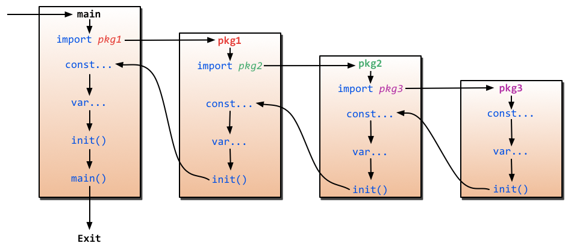
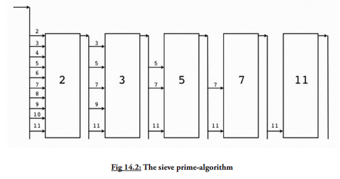

<h1 align="center">Go个人总结<h1>


[TOC]

## 一.基础语法

### 基础类型和运算符

1. s:=123这种定义是int32还是int64还是其他类型？试着赋值给其给int32或int64看是否需要强制转换? s:=123这种定义是int类型,需要强制转换才能赋值给int32或int64

2. 在 fmt.Printf 中使用下面的说明符来打印有关变量的相关信息：
    * %+v 打印包括字段在内的实例的完整信息
    * %#v 打印包括字段和限定类型名称在内的实例的完整信息
    * %T 打印某个类型的完整说明

3. 在Go语言中,&& 和 || 是具有快捷性质的运算符，当运算符左边表达式的值已经能够决定整个表达式的值的时候（&& 左边的值为 false，|| 左边的值为 true），运算符右边的表达式将不会被执行。**利用这个性质，如果你有多个条件判断，应当将计算过程较为复杂的表达式放在运算符的右侧以减少不必要的运算。**

4. 格式化说明
  在格式化字符串里，%d 用于格式化整数（%x 和 %X 用于格式化 16 进制表示的数字），%g 用于格式化浮点型（%f 输出浮点数，%e 输出科学计数表示法），%0d 用于规定输出定长的整数，其中开头的数字 0 是必须的。%n.mg 用于表示数字 n 并精确到小数点后 m 位，除了使用 g 之外，还可以使用 e 或者 f，例如：使用格式化字符串 %5.2e 来输出 3.4 的结果为 3.40e+00。

5. 运算符于优先级
  有些运算符拥有较高的优先级，二元运算符的运算方向均是从左至右。

6. 获取字符串中某个字节的地址的行为是非法的,例如:&str[i]

7. 编译器会将未使用的局部变量当作错误，全局变量未使用没问题，常量不管是全局常量还是局部常量未使用都不报错；

8. 引用类型包括slice、map和channel。他们有复杂的内部结构，除了申请内存外，还需要初始化相关属性；内置函数new计算类型大小，为其分配零值内存，返回指针。而make会被编译器翻译成具体的创建函数，由其分配内存和初始化成员结构，返回对象而非指针。

9. 可通过自定义类型来实现枚举类型限制

    ```go
    type Color int
    const (
    	Black Color = iota
    	Red
    	Blue
    )
    func test(c Color) {}
    func main(){
    	c := Black
    	test(c)
    	x:=1
    	test(x) // Error: cannot use x (type int) as type Color in function argument
    	test(1) // 常量会被编译器自动转换
    }
    ```

10. 在常量数组中，如不提供类型和初始化值，那么视作与上一常量相同

  ```go
  const (
  	s = "abc"
  	x			// x = "abc"
  )
  ```

11. 多变量赋值时，先计算所有相关值，然后再从左到右依次赋值
     ```go
     package main

     import "fmt"

     func main() {
     	data, i := [3]int{0, 1, 2}, 0
     	i, data[i] = 2, 100 // (i=0)->(i=2),(data[0]=100)
     	fmt.Println(i)
     	fmt.Println(data)
     }
     /**
      运行结果
      2
      [100 1 2]
      */
     ```
### 函数

#### 闭包

匿名函数同样被称之为闭包(函数时语言的术语):它们被允许调用定义在其它环境下的变量.闭包可使得某个函数扑捉到一些外部状态,例如:函数被创建时的状态.另一种表示方式为:一个闭包继承了函数所声明时的作用域.这种状态(作用域内的变量)都被共享到闭包的环境中,因此这些变量可以在闭包中被操作,直到被销毁

```go
package main

import "fmt"

func main() {
	f := colosure(10)
	fmt.Println(f(1))
	fmt.Println(f(2))
	fmt.Println(f(3))
}
func colosure(x int) func(int) int {
	fmt.Printf("%p\n", &x)
	return func(y int) int {
		fmt.Printf("%p\n", &x)
		return x + y
	}
}

/*
//运行结果
0xc0420381d0
0xc0420381d0
11
0xc0420381d0
12
0xc0420381d0
13
*/
```

#### Defer

使用defer实现代码追踪:
```go
package main

import "fmt"

func main() {
	b()
}
func trace(s string) string {
	fmt.Println("Entering:", s)
	return s
}
func un(s string) {
	fmt.Println("Leaving:", s)
}
func a() {
	defer un(trace("a"))
	fmt.Println("in a")
}
func b() {
	defer un(trace("b"))
	fmt.Println("in b")
	a()
}

/*
//运行结果
Entering: b
in b
Entering: a
in a
Leaving: a
Leaving: b
*/
```

使用defer语句来记录函数的参数与返回值

```go
package main

import (
	"io"
	"log"
)

func main() {
	func1("Go")
}
func func1(s string) (n int, err error) {
	defer func() {
		log.Printf("func1(%q) = %d, %v\n", s, n, err)
	}()
	return 7, io.EOF
}

/*
//运行结果
2017/05/05 17:01:54 func1("Go") = 7, EOF
*/

```

```go
package main

import "fmt"

func main() {
	for i := 0; i < 3; i++ {
		defer fmt.Println(i)
	}
	for i := 0; i < 3; i++ {
		defer func() {
			fmt.Println(i)
		}()
	}
}

/*
//运行结果
3
3
3
2
1
0
*/

```

#### Return

显式return返回前，会先修改命名返回参数：
```go
package main

import "fmt"

func main() {
	fmt.Println(add(1, 2)) // 输出：203
}

// 显式return返回前，会先修改命名返回参数
func add(x, y int) (z int) {
	defer func() {
		fmt.Println(z) // 输出：203
	}()
	z = x + y
	return z + 200 // 执行顺序：(z = z + 200) -> (call defer) -> (ret)
}
```


#### Panic,Recover

beego中api接口每个携程有安装recover函数,不必自己安装,也就是说如果接口里面panic了,主进程不会挂掉,而如果接口里面自己又go func自己创建了携程,则此时携程里面如果panic会导致整个进程挂掉,避免的方式是在子携程函数里面再安装recover,如果此时panic,不会影响到主进程.

```go
package main

import "fmt"

func main() {
	A()
	B()
	C()
}
func A() {
	fmt.Println("Func A")
}
func B() {
	defer func() {
		if err := recover(); err != nil {
			fmt.Println("Recover in B")
		}
	}()
	panic("Panic in B")
}
func C() {
	fmt.Println("Func C")
}

/*
//运行结果
Func A
Recover in B
Func C
*/
```

```go
package main

import "fmt"

func main() {
	var fs = [4]func(){}
	for i := 0; i < 4; i++ {
		defer fmt.Println("defer i = ", i)
		defer func() { fmt.Println("defer_colosure i = ", i) }()
		fs[i] = func() { fmt.Println("colosure i = ", i) }
	}
	for _, f := range fs {
		f()
	}
}

/*
//运行结果
colosure i =  4
colosure i =  4
colosure i =  4
colosure i =  4
defer_colosure i =  4
defer i =  3
defer_colosure i =  4
defer i =  2
defer_colosure i =  4
defer i =  1
defer_colosure i =  4
defer i =  0
*/
```

如果需要保护代码片段，可将代码块重构成匿名函数，如此可确保后续代码被执行

```go
package main

import "fmt"

func main() {
	test(8, 0)
}

// 如果需要保护代码片段，可将代码块重构成匿名函数，如此可确保后续代码被执行
func test(x, y int) {
	var z int
	func() {
		defer func() {
			if recover() != nil {
				z = 0
			}
		}()
		z = x / y
		return
	}()
	fmt.Println("x / y = ", z)
}

```


#### 变长参数

```go
package main

import "fmt"

func main() {
	a := []int{1, 2, 3}
	fmt.Println(a)
	mytest(a...) // 此时为引用传递
	fmt.Println(a)
	x, y, z := 11, 22, 33
	mytest(x, y, z) // 此时为值传递
	fmt.Println(x, y, z)
}
func mytest(a ...int) {
	for i := range a {
		a[i] = 33
	}
}

/*
//运行结果
[1 2 3]
[33 33 33]
11 22 33
*/
```
func test(a ...interface{})传递验证

```go
package main

import "fmt"

func main() {
	mytest(1, "aa", 88.6)
}
func mytest(a ...interface{}) {
	fmt.Println(a)
}

/*
//运行结果
[1 aa 88.6]
*/
```


#### 工厂函数

一个返回值为另一个函数的函数可以被称之为工厂函数，这在您需要创建一系列相似的函数的时候非常有用：书写一个工厂函数而不是针对每种情况都书写一个函数。下面的函数演示了如何动态返回追加后缀的函数：

```go
func MakeAddSuffix(suffix string) func(string) string {
	return func(name string) string {
		if !strings.HasSuffix(name, suffix) {
			return name + suffix
		}
		return name
	}
}
```

现在,我们可以生成如下函数:

```go
addBmp := MakeAddSuffix(".bmp")
addJpeg := MakeAddSuffix(".jpeg")
//然后调用它们：
addBmp("file") // returns: file.bmp
addJpeg("file") // returns: file.jpeg
```

可以返回其它函数的函数和接受其它函数作为参数的函数均被称之为高阶函数，是函数式语言的特点。我们已经在第 6.7 中得知函数也是一种值，因此很显然 Go 语言具有一些函数式语言的特性。闭包在 Go 语言中非常常见，常用于 goroutine 和管道操作

#### 函数的奇葩点

1. Golang中函数被看做是值,函数值不可以比较，也不可以作为map的key

   请问一下代码能编译通过吗？

   ```go
   package main
   
   import "fmt"
   
   func main(){
   	array:=make(map[int]func()int)
   	array[func()int{return 10}()] = func()int{
   		return 12
   	}
   	fmt.Println(array)
   	fmt.Println(array[10])
   	fmt.Println(array[10]())
   }
   // 可以正常编译通过
   ```

   稍做改动，改成如下情况，还能编译通过吗？

   ```go
   import (
   	"fmt"
   )
   func main(){
   	array := make(map[func ()int]int)
   	array[func()int{return 12}] = 10
   	fmt.Println(array)
   }
   // 不能编译通过
   ```

   在Go语言中，函数被看做是第一类值：(first-class values)：函数和其他值一样，可以被赋值，可以传递给函数，可以从函数返回。也可以被当做是一种“函数类型”。例如：有函数func square(n int) int { return n * n }，那么就可以赋值f := square,而且还可以fmt.Println(f(3))（将打印出“9”）。

   Go语言函数有两点很特别：
   函数值类型不能作为map的key
   函数值之间不可以比较，函数值只可以和nil作比较，函数类型的零值是nil

2. Go语言中函数返回的是值的时候，不能赋值

   请看下面例子:

   ```go
   type Employee struct {
       ID int
       Name string
       Address string
       DoB time.Time
       Position string
       Salary int
       ManagerID int
   }
   func EmployeeByID(id int) Employee {
       return Employee{ID:id}
   }
   func main(){
       EmployeeByID(1).Salary = 0
   }
   ```

   请问能编译通过吗？

   运行，输出报错：`cannot assign to EmployeeByID(1).Salary`

   在本例子中，函数`EmployeeById(id int)`返回的是值类型的，它的取值`EmployeeByID(1).Salary`也是一个值类型；值类型是什么概念？值类型就是和赋值语句`var a = 1`或`var a = hello world`等号`=`右边的`1`、`Hello world`是一个概念，他是不能够被赋值的，只有变量能够被赋值。

   修改程序如下：

   ```go
   type Employee struct {
       ID int
       Name string
       Address string
       DoB time.Time
       Position string
       Salary int
       ManagerID int
   }
   func EmployeeByID(id int) Employee {
       return Employee{ID:id}
   }
   func main(){
       var a = EmployeeByID(1)
       a.Salary = 0
   }
   ```

   这就可以编译通过了

3. 匿名函数作用于陷阱

   请看下面代码输出什么？

   ```go
   package main
   
   import (
   	"fmt"
   )
   
   func main() {
   	var msgs []func()
   	array := []string{
   		"1", "2", "3", "4",
   	}
   	for _, e := range array {
   		msgs = append(msgs, func() {
   			fmt.Println(e)
   		})
   	}
   	for _, v := range msgs {
   		v()
   	}
   }
   
   /*
    答案:
    4
    4
    4
    4
   */
   
   ```

   在上述代码中，匿名函数中记录的是循环变量的内存地址，而不是循环变量某一时刻的值。
   想要输出1、2、3、4需要改为：

   ```go
   import (
   	"fmt"
   )
   func main(){
   	var msgs []func()
   	array := []string{
   		"1", "2", "3", "4",
   	}
   	for _, e := range array{
   		elem := e
   		msgs = append(msgs, func(){
   			fmt.Println(elem)
   		})
   	}
   	for _, v := range msgs{
   		v()
   	}
   }
   ```

   其实就加了条elem := e看似多余，其实不，这样一来，每次循环后每个匿名函数中保存的就都是当时局部变量elem的值，这样的局部变量定义了4个，每次循环生成一个。

#### 匿名函数

* 匿名函数可赋值给变量，做为结构字段，或者在channel里传送

* 闭包复制的是原对象指针，这就很容易解释延迟引用现象。

  ```go
  package main
  
  import "fmt"
  
  func main() {
  	f := test()
  	f()
  }
  func test() func() {
  	x := 100
  	fmt.Printf("x (%p) = %d\n", &x, x)
  	return func() {
  		fmt.Printf("x (%p) = %d\n", &x, x)
  	}
  }
  
  /*
   输出：
   x (0xc04204c088) = 100
   x (0xc04204c088) = 100
  */
  ```


### 数组与切片

#### 基础概念
* 数组长度也是数组类型的一部分，所以[5]int和[10]int是属于不同类型的。数组的编译时值初始化是按照数组顺序完成的

  ```go
  package main

  import (
  	"fmt"
  	"reflect"
  )

  func main() {
  	arrayA := [...]int{1, 2, 3}
  	arrayB := [...]int{1, 2, 3, 4}
  	fmt.Println(reflect.TypeOf(arrayA))
  	fmt.Println(reflect.TypeOf(arrayB))
  	fmt.Println(reflect.TypeOf(arrayA) == reflect.TypeOf(arrayB))
  }
  /*
   [3]int
   [4]int
   false
   */
  ```

  ​

* 元素的数目，也称为长度或者数组大小必须是固定的并且在声明该数组时就给出（编译时需要知道数组长度以便分配内存）；数组长度最大为 2Gb

* 如果我们想让数组元素类型为任意类型的话可以使用空接口作为类型当使用值时我们必须先做一个类型判断;

* 数组还可以指定一个索引和对应值的方式来初始化

  ```go
  package main

  import (
  	"fmt"
  )

  func main() {
  	arrayA := [...]int{0: 1, 2: 1, 3: 4}
  	fmt.Println(arrayA)
  	fmt.Println(len(arrayA))
  }
  /*
   [1 0 1 4]
   4
   */
  ```

  没错，定义了一个数组长度为4的数组，指定索引的数组长度和最后一个索引的数值相关，例如:`r := [...]int{99:-1}`就定义了一个含有100个元素的数组`r`，最后一个元素输出化为-1，其他的元素都是用0初始化。

* 要修改字符串，可先将其转换成[]rune或[]byte，完成后再转换为string。无论哪种转换，都会重新分配内存，并复制字节数组。

  ```go
  func main() {
    s := "abcd"
    bs := []byte(s)
    bs[1] = 'B'
    println(string(bs))
    
    u := "电脑"
    us := []rune(u)
    us[1] = '话'
    println(string(us))
  }
  ```

  用for循环遍历字符串时，也有byte和rune两种方式。

  ```go
  package main
  import "fmt"
  func main() {
  	s := "abc汉字"
  	for i := 0; i < len(s); i++ {
  		fmt.Printf("%c,", s[i])
  	}
  	fmt.Println()
  	for _, r := range s {
  		fmt.Printf("%c,", r)
  	}
  }
  /**
  运行结果：
  a,b,c,æ,±,‰,å,­,—,
  a,b,c,汉,字,
  */
  ```

  ​

* 由于长度也是数组类型的一部分，因此[3]int与[4]int是不同的类型，数组也就不能改变长度。数组之间的赋值是值的赋值，即当把一个数组作为参数传入函数的时候，传入的其实是该数组的副本，而不是它的指针。如果要使用指针，那么就需要用到后面介绍的slice类型了。验证函数传递

* ```go
  package main

  import "fmt"

  func main() {
  	arr := [...]int{1, 2, 3}
  	fmt.Println("all before:", arr)
  	test_value(arr)
  	fmt.Println("value after:", arr)
  	test_point(&arr)
  	fmt.Println("point after:", arr)
  	test_slice(arr[:])
  	fmt.Println("slice after:", arr)
  }
  func test_value(arr [3]int) {
  	arr[1] = 111
  	fmt.Println("test_value:", arr)
  }
  func test_point(arr *[3]int) {
  	arr[1] = 222
  	fmt.Println("test_point:", arr)
  }
  func test_slice(arr []int) {
  	arr[1] = 333
  	fmt.Println("test_slice:", arr)
  }
  ```

* 注意:绝对不要用指针指向slice. 切片本身已经是一个引用类型,所以它本身就是一个指针.

* []interface{}这种切片是否可以存储不同数据类型? 可以,因为该切片出存储的类型是interface{}
#### new和make的区别

* 看起来二者没什么区别,都在堆上分配内存,但是它们的行为不同个,适用于不同的类型;

* new(T)为每个新的类型T分配一片内存,初始化为0并且返回类型为*T的内存地址:这种方法返回一个指向类型为T,值为0的地址的指针,它适用于值类型,如数组和结构体;它相当于&T{};

* make(T)返回一个类型为T的初始值,它只适用于3种内建的引用类型:切片,map和channel;

* 换言之,new函数分配内存,make函数初始化;

* 下面的例子说明了在映射上使用 new 和 make 的区别以及可能发生的错误：

  ```go
  package main

  type Foo map[string]string
  type Bar struct {
  	thingOne string
  	thingTwo int
  }

  func main() {
  	// OK
  	y := new(Bar)
  	(*y).thingOne = "hello"
  	(*y).thingTwo = 1
  	// NOT OK
  	z := make(Bar) // 编译错误：cannot make type Bar
  	(*z).thingOne = "hello"
  	(*z).thingTwo = 1
  	// OK
  	x := make(Foo)
  	x["x"] = "goodbye"
  	x["y"] = "world"
  	// NOT OK
  	u := new(Foo)
  	(*u)["x"] = "goodbye" // 运行时错误!! panic: assignment to entry in nil map
  	(*u)["y"] = "world"
  }
  ```
* 试图 make() 一个结构体变量，会引发一个编译错误，这还不是太糟糕，但是 new() 一个映射并试图使用数据填充它，将会引发运行时错误！ 因为 new(Foo) 返回的是一个指向 nil 的指针，它尚未被分配内存。所以在使用 map 时要特别谨慎。
#### append

* 如果你想将切片 y 追加到切片 x 后面，只要将第二个参数扩展成一个列表即可：x = append(x, y...)

* 将一个字符串追加到某一个字符数组的尾部

  ```go
  package main

  import "fmt"

  func main() {
  	str := "abc中国sd"
  	var b []byte
  	b = append(b, str...)
  	fmt.Println(string(b))
  }
  ```

* 将切片 b 的元素追加到切片 a 之后：a = append(a, b...)

* 复制切片 a 的元素到新的切片 b 上：b = make([]T, len(a)); copy(b, a)

* 删除位于索引 i 的元素：a = append(a[:i], a[i+1:]...)

* 切除切片 a 中从索引 i 至 j 位置的元素：a = append(a[:i], a[j:]...)

* 为切片 a 扩展 j 个元素长度：a = append(a, make([]T, j)...)

* 在索引 i 的位置插入元素 x：a = append(a[:i], append([]T{x}, a[i:]...)...)

* 在索引 i 的位置插入长度为 j 的新切片：a = append(a[:i], append(make([]T, j), a[i:]...)...)

* 在索引 i 的位置插入切片 b 的所有元素：a = append(a[:i], append(b, a[i:]...)...)

* 取出位于切片 a 最末尾的元素 x：x, a = a[len(a)-1], a[:len(a)-1]

* 将元素 x 追加到切片 a：a = append(a, x)

* 因此，您可以使用切片和 append 操作来表示任意可变长度的序列。
    从数学的角度来看，切片相当于向量，如果需要的话可以定义一个向量作为切片的别名来进行操作

#### 切片的引用传递和append要点

* Go语言中channel，slice，map这三种类型的实现机制类似指针，所以可以直接传递，而不用取地址后传递指针。（注：若函数需改变slice的长度，则仍需要取地址传递指针）

* 引用传递,实际上是引用地址的值传递;append之所以需要接收返回值是因为每次append后需要返回切片底层对应数组的开始地址和切片长度;不说了,看例子

  ```go
  package main

  import "fmt"

  func main() {
  	sourData := [5]int{0, 1, 2, 3, 4}
  	data := sourData[0:4]
  	fmt.Println(data)
  	//mytest1(data)
  	//mytest2(&data)
  	mytest3(data)
  	fmt.Println(data)
  	fmt.Println(sourData)
  }
  func mytest1(data []int) {
  	data = append(data, 33)
  }
  func mytest2(data *[]int) {
  	*data = append(*data, 33)
  }
  func mytest3(data []int) {
  	data[2] = 22
  }

  /*
  //mytest1运行结果
  [0 1 2 3]
  [0 1 2 3]
  [0 1 2 3 33]
  //mytest2运行结果
  [0 1 2 3]
  [0 1 2 3 33]
  [0 1 2 3 33]
  //mytest3运行结果
  [0 1 2 3]
  [0 1 22 3]
  [0 1 22 3 4]
  */
  ```

* 切片三要素:起始地址,实际长度,容量长度;分析以下程序

  ```go
  package main

  import "fmt"

  func main() {
  	data := make([]int, 1, 3)
  	fmt.Printf("main中data地址:%p\n", data)
  	fmt.Println("调用mytest前:", data)
  	fmt.Printf("调用mytest前:len(data)=%d,cap(data)=%d\n", len(data), cap(data))
  	data2 := mytest(data)
  	fmt.Println("调用mytest后:", data)
  	fmt.Printf("调用mytest后:len(data)=%d,cap(data)=%d\n", len(data), cap(data))
  	fmt.Println("data2:", data2)
  	fmt.Printf("data2地址:%p\n", data2)
  	fmt.Printf("data2:len(data2)=%d,cap(data2)=%d\n", len(data2), cap(data2))
  }
  func mytest(x []int) []int {
  	fmt.Printf("mytest中append前:len(x)=%d,cap(x)=%d\n", len(x), cap(x))
  	x[0] = 11
  	fmt.Printf("mytest中x地址:%p\n", x)
  	x = append(x, 33) // 此处成 x = append(x, 33, 44, 55, 66) 对比不同点
  	fmt.Printf("mytest中x地址:%p\n", x)
  	fmt.Println("mytest中", x)
  	fmt.Printf("mytest中append后:len(x)=%d,cap(x)=%d\n", len(x), cap(x))
  	return x
  }

  /**
  运行结果:
  main中data地址:0xc0420026a0
  调用mytest前: [0]
  调用mytest前:len(data)=1,cap(data)=3
  mytest中append前:len(x)=1,cap(x)=3
  mytest中x地址:0xc0420026a0
  mytest中x地址:0xc0420026a0
  mytest中 [11 33]
  mytest中append后:len(x)=2,cap(x)=3
  调用mytest后: [11]
  调用mytest后:len(data)=1,cap(data)=3
  data2: [11 33]
  data2地址:0xc0420026a0
  data2:len(data2)=2,cap(data2)=3

  个人分析:
  切片包含:起始地址,实际长度,空间长度
  我在mytest里面append虽然空间长度够,但是依然是值的方式修改了slice的实际长度,
  此时main函数里面的slice实际长度依然没有改变,所以不影响main.
  mytest里面append改变了slice的len,但是主函数里面的len没有改变, 虽然他们地址都一样,但是内容就不一样了
  还有之所以append需要接收返回值也说明了这个问题;x = append(x, 33)
  slice原型:
  type slice struct{
      array unsafe.Pointer
      len int
      cap int
  }
  */

  ```

* 注意： append 在大多数情况下很好用，但是如果你想完全掌控整个追加过程，你可以实现一个这样的 AppendByte 方法:

  ```go
  func AppendByte(slice []byte, data ...byte) []byte {
      m := len(slice)
      n := m + len(data)
      if n > cap(slice) { // if necessary, reallocate
          // allocate double what's needed, for future growth.
          newSlice := make([]byte, (n+1)*2)
          copy(newSlice, slice)
          slice = newSlice
      }
      slice = slice[0:n]
      copy(slice[m:n], data)
      return slice
  }
  ```

  func copy(dst, src []T) int copy 方法将类型为 T 的切片从源地址 src 拷贝到目标地址 dst，覆盖 dst 的相关元素，并且返回拷贝的元素个数。源地址和目标地址可能会有重叠。拷贝个数是 src 和 dst 的长度最小值。如果 src 是字符串那么元素类型就是 byte。如果你还想继续使用 src，在拷贝结束后执行 src = dst。

#### copy
* 假设s是一个字符串(本质上是一个字节数组),那么就可以通过c:=[]byte(s)来获取一个字节的切片c,另外,您还可以通过copy函数来达到相同的目的:copy(dst []byte, src string)

#### 切片和垃圾回收
* 切片的底层指向一个数组,该数组的实际容量可能要大于切片所定义的容量.只有在没有任何切片指向的时候,底层的数组内层才会被释放,这种特性有时会导致程序占用多余的内存.

* 示例函数FindDigits将一个文件加载到内存,然后搜索其中所有的数字并返回一个切片

  ```go
  var digitRegexp = regexp.MustCompile("[0-9]+")
  func main() {
      FindDigits("./test.txt")
  }
  func FindDigits(filename string) []byte {
      b, _ := ioutil.ReadFile(filename)
      return digitRegexp.Find(b)
  }
  ```

* 这段代码可以顺利运行,但返回的[]byte指向的底层是整个文件的数据.只要该返回的切片不被释放,垃圾回收器就不能释放整个文件所占用的内存.换句话说,一点点有用的数据却占用了整个文件的内存.

* 想要避免这个问题,可以通过拷贝我们需要的部分到一个新的切片中:

  ```go
  var digitRegexp = regexp.MustCompile("[0-9]+")
  func main() {
      FindDigits("./test.txt")
  }
  func FindDigits(filename string) []byte {
      b, _ := ioutil.ReadFile(filename)
      return digitRegexp.Find(b)
      c := make([]byte, len(b))
      copy(c, b)
      return c
  }
  ```

### range

注意：range会复制对象

```go
package main
import "fmt"
func main() {
	a := [3]int{0, 1, 2}
	for i, v := range a { // index、value都是从复制品取出(从a中复制整个数组对象)
		if i == 0 { // 在修改前，我们先修改原数组(不是修改复制后的数组)
			a[1], a[2] = 999, 999
			fmt.Println(a) // 确认修改有效，输出[0,999,999]
		}
		a[i] = v + 100 // 使用复制品中取出的value修改原数组
	}
	fmt.Println(a) // 输出[100,101,102]
}
/**
运行结果
[0 999 999]
[100 101 102]
*/
```

建议改用引用类型，其底层数据不会被复制

```go
package main

import "fmt"

func main() {
	s := []int{1, 2, 3, 4, 5}
	fmt.Printf("enter for:%p len(s)=%d\n", s, len(s))
	for i, v := range s { // 复制 struct slice {pointer, len, cap}
		if i == 0 {
			s = s[:3] // 对slice的修改，不会影响range的长度
			fmt.Printf("in    for:%p len(s)=%d\n", s, len(s))
			s[2] = 100 // 对底层数据的修改
		}
		fmt.Println(i, v)
	}
	fmt.Printf("exit  for:%p len(s)=%d\n", s, len(s))
	fmt.Println(s)
}

/**
运行结果
enter for:0xc04203bf50 len(s)=5
in    for:0xc04203bf50 len(s)=3
0 1
1 2
2 100
3 4
4 5
exit  for:0xc04203bf50 len(s)=3
[1 2 100]
*/

```

另外两种引用类型map、channel都是指针包装，而不像slice是struct

### Map

#### 基础概念

1. map 传递给函数的代价很小：在 32 位机器上占 4 个字节，64 位机器上占 8 个字节，无论实际上存储了多少数据。

2. 通过 key 在 map 中寻找值是很快的，比线性查找快得多，但是仍然比从数组和切片的索引中直接读取要慢 100 倍；所以如果你很在乎性能的话还是建议用切片来解决问题。

3. 如果 key1 是 map1 的key，那么 map1[key1] 就是对应 key1 的值，就如同数组索引符号一样（数组可以视为一种简单形式的 map，key 是从 0 开始的整数）。

4. 常用的 len(map1) 方法可以获得 map 中的 pair 数目，这个数目是可以伸缩的，因为 map-pairs 在运行时可以动态添加和删除。

5. 不要使用 new，永远用 make 来构造 map

   注意 如果你错误的使用 new() 分配了一个引用对象，你会获得一个空引用的指针，相当于声明了一个未初始化的变量并且取了它的地址：

   mapCreated := new(map[string]float32)


6. map 类型是不存在锁的机制来实现这种效果(出于对性能的考虑),所以 map 类型是非线程安全的.当并行访问一个共享的 map 类型的数据，map 数据将会出错

7. map和其他基本型别不同，它不是thread-safe，在多个go-routine存取时，必须使用mutex lock机制

8. 当map为nil的时候，不能添加值

   ```go
   func main() {
       var sampleMap map[string]int
       sampleMap["test"] = 1
       fmt.Println(sampleMap)
   }
   /*
   报错：panic: assignment to entry in nil map
   */
   ```

   必须使用make或者将map初始化之后，才可以添加元素。

   以上代码可以改为:

   ```go
   unc main() {
       var sampleMap map[string]int
       sampleMap = map[string]int {
           "test1":1,
       }
       sampleMap["test"] = 1
       fmt.Println(sampleMap)
   }
   /*
   map[test1:1 test:1]
   */
   ```

9. 不能对map中的某个元素进行取地址&操作

   ```go
   a := &ages["bob"] // compile error: cannot take address of map element
   ```

   map中的元素不是一个变量，不能对map的元素进行取地址操作，禁止对map进行取地址操作的原因可能是map随着元素的增加map可能会重新分配内存空间，这样会导致原来的地址无效

#### 提问要点

1. 未初始化的map打印出来是怎样？map[]吗？初始化后呢？

   ```go
   func main() {
       var m map[int]int
       fmt.Println(m)
       //m = make(map[int]int)
       m = make(map[int]int, 1)
       fmt.Println(m)
   }
   /*
    * 运行结果
    * map[]
    * map[]
    */
   ```

2.  Map是值类型还是引用类型？

   ```go
   func main() {
       m := map[int]string{1: "aaa", 2: "bbb"}
       fmt.Println(m)
       mytest(m)
       fmt.Println(m)
   }
   func mytest(m map[int]string) {
       m[1] = "ccc"
   }
   /*
    * 运行结果
    * map[1:aaa 2:bbb]
    * map[1:ccc 2:bbb]
    */
   ```

   ​


### 指针

1. 指向数组的指针和指针数组

   ```go
   package main
   import (
   	"fmt"
   )
   func main() {
   	a := [...]int{9: 1}
   	var p *[10]int = &a // p是指向数组的指针
   	fmt.Println(p)
   	x, y := 1, 2
   	b := [...]*int{&x, &y} // b是指针数组
   	fmt.Println(b)
   }
   /**
    运行结果:
    &[0 0 0 0 0 0 0 0 0 1]
    [0xc042008298 0xc0420082b0]
   */
   ```

2. 返回局部变量指针是安全的，编译器会根据需要将其分配在GC Heap上。

   ```go
   func test() *int {
     x := 100
     return &x
   }
   ```

3. 可以在unsafe.Pointer和任意类型指针间进行转换。

   ```go
   package main
   import (
   	"fmt"
   	"unsafe"
   )
   func main() {
   	x := 0x12345678
   	p := unsafe.Pointer(&x)
   	n := (*[4]byte)(p)
   	for i := 0; i < len(n); i++ {
   		fmt.Printf("%X ", n[i])
   	}
   }
   /**
    运行结果:
    78 56 34 12
    */
   ```

4. 将Pointer 转换成uintptr，可变相实现指针运算

   ```go
   package main
   import (
   	"fmt"
   	"unsafe"
   )
   func main() {
   	d := struct {
   		s string
   		x int
   	}{"abc", 100}
   	p := uintptr(unsafe.Pointer(&d)) // *struct -> Pointer -> uintptr
   	p += unsafe.Offsetof(d.x)        // uintptr + offset
   	p2 := unsafe.Pointer(p)          // uintptr -> Pointer
   	px := (*int)(p2)                 // Pointer -> *int
   	*px = 200                        // d.x = 200
   	fmt.Printf("%#v\n", d)
   	// 注意：GC把uintptr当成普通证书对象，它无法阻止“关联”对象被回收。
   }
   /**
   运行结果:
   struct { s string; x int }{s:"abc", x:200}
   */
   ```

5. 函数传递

   * 传递指针使得多个函数能操作同一个对象；
   * 传递指针比较轻量级(8bytes)，只是传递内存地址，我们可以用指针传递体积大的结构体。如果用参数值传递的话, 在每次copy上面就会花费相对较多的系统开销（内存和时间）。所以当你要传递大的结构体的时候，用指针是一个明智的选择；
   * Go语言中channel，slice，map这三种类型的实现机制类似指针，所以可以直接传递，而不用取地址后传递指针。（注：若函数需改变slice的长度，则仍需要取地址传递指针）；

6. 哪些是值传递，哪些是引用传递？什么类型变量不需要((*s).x)这样引用，可以直接(s.x)，哪些只能((*s).x)？

   * 基本数据类型，如int、float、string等是值类型，基本类型如果是指针都需要*s；
   * 数组是值类型，不管是数组本身还是指向数组本身，都可以用a[1]这种方式，指针不需要前面加*；
   * 结构体是值类型，结构体无论是值还是指针，都是直接使用(s.x);
   * 切片是引用类型；内部指向底层数组；
   * map是引用类型；
   * channel是引用类型；

### 包

#### 基础概念

1. 导入的包在自身初始化前被初始化，而一个包在程序执行中只能初始化一次

#### 提问

1. 实验多个代码文件共享一个包，并且有init函数？

   当引入包有init函数的时候,优先执行该init函数.并且当同个项目中多次引入同个包时,只执行一次init函数。

2. golang包名必须与所在文件夹同名吗？
   不必须，但是同个目录中（不含子目录）的所有文件包名必须一致，通常为了方便包定位，建议包名和目录名一致，否则你import "A"，使用起来B.xxx，看上去不统一，不能一眼看出来这个B包是哪个文件的。

3. src目录下有mytest文件夹，里面有mytest.go包，引用该包的时候为什么是import "mytest"   而不是import "mytest/mytest" ？
   import引号后面的只是包所在路径,具体使用的时候是使用该路径下的包名(一般最好和所在文件夹名称一致)来使用. 例如fmt.Println(“hello,world”) 我们调用了fmt包里面定义的函数Println。大家可以看到，这个函数是通过<pkgName>.<funcName>的方式调用的，这一点和Python十分相似。前面提到过，包名和包所在的文件夹名可以是不同的，此处的<pkgName>即为通过package <pkgName>声明的包名，而非文件夹名。

4. GOPATH目录下三个子目录,src,pkg,bin,当我们引入第三方包时,源代码都是在src目录下,如果安装该包,那么编译后的包文件会在pkg子目录下,但是为什么使用该包的时候还是需要源代码存在?而不是只要pkg子目录下的*.a包文件就可以了?

5. 定义在包中函数内部的大写字母开头的变量，包外可以访问吗？
   不行,必须是包中函数外部的公有变量,包外部才可以访问，函数内部的变量是局部变量。

6. 结构体中变量的首字母大小写，包外部访问性如何？
   不可以直接访问;
   如果该结构体变量定义在包中,并且该结构体变量名为可访问性质,那么包外可以直接访问整个结构体,但是不能访问结构体内部的变量;
   如果如果结构体变量定义在包外部,那么连这个变量只能初始化可访问的成员，对于不可见的成员无法初始化。

   ```go
   //demo.go
   package demo
   type Data struct {
   	A string `json:"a"`
   	b string `json:"b"`
   }
   var DemoA Data = Data{
   	A: "A",
   	b: "b",
   }
   //main.go
   package main
   import (
   	"fmt"
   	"test/demo"
   )
   func main() {
   	externDemo := demo.Data{A: "AA"} // 只能初始化A变量，b变量不可见无法初始化
   	fmt.Println(externDemo)

   	fmt.Println(demo.DemoA)
   	fmt.Println(demo.DemoA.A)
   	//fmt.Println(demo.X.b) // 无法直接访问不可见变量b
   }
   ```

   ​

7. 引入一个包的执行流程？
   


### 结构体

#### 基本概念

1. Go 语言中，结构体和它所包含的数据在内存中是以连续块的形式存在的，即使结构体中嵌套有其他的结构体，这在性能上带来了很大的优势。

2. 相同结构的匿名类型等价,可以互相替换,但是不能有任何方法(Go语言程序设计:6.4节详细阐述)

3. 命名的自定义类型即使结构完全相同,也不能相互替换

4. 如果想知道结构体类型T的一个实例占用了多少内存，可以使用：size := unsafe.Sizeof(T{})

5. &dilbert.Position和(&dilbert).Position是不同的

   `&dilbert.Position`相当于`&(dilbert.Position)`而非`(&dilbert).Position`

   请看例子：

   请问输出什么？

   ```go
   func main(){
       type Employee struct {
           ID int
           Name string
           Address string
           DoB time.Time
           Position string
           Salary int
           ManagerID int
       }
       var dilbert Employee
       dilbert.Position = "123"
       position := &dilbert.Position
       fmt.Println(position)
   }
   // 0xc42006c220
   ```

   输出的是内存地址

   修改一下，把`&dilbert.Position`改为`(&dilbert).Position`

   ```go
   func main(){
       type Employee struct {
           ID int
           Name string
           Address string
           DoB time.Time
           Position string
           Salary int
           ManagerID int
       }
       var dilbert Employee
       dilbert.Position = "123"
       position := &dilbert.Position
       fmt.Println(position)
   }
   // 123
   ```

   ​

6. 结构体序列化到json字符串时,指定某些字段如果为空则不序列话,或者指定某字段不序列化

   ```go
   type Message struct {
       Name string `json:"msg_name"`       // 对应JSON的msg_name
       Body string `json:"body,omitempty"` // 如果为空则忽略字段
       Time int64  `json:"json:"-"`        // 直接忽略字段
   }
   ```

#### 结构体工厂
1. Go 语言不支持面向对象编程语言中那样的构造子方法，但是可以很容易的在 Go 中实现 “构造子工厂”方法。为了方便通常会为类型定义一个工厂，按惯例，工厂的名字以 new 或 New 开头。假设定义了如下的 File 结构体类型

   ```go
   type File struct {
       fd      int     // 文件描述符
       name    string  // 文件名
   }
   ```

   下面是这个结构体类型对应的工厂方法，它返回一个指向结构体实例的指针：

   ```go
   func NewFile(fd int, name string) *File {
       if fd < 0 {
           return nil
       }
       return &File{fd, name}
   }
   ```

   在 Go 语言中常常像上面这样在工厂方法里使用初始化来简便的实现构造函数。

   如果 File 是一个结构体类型，那么表达式 new(File) 和 &File{} 是等价的。

2. 如何强制使用工厂方法？

   ```go
   通过应用可见性规则,就可以禁止使用 new 函数，强制用户使用工厂方法，从而使类型变成私有的，就像在面向对象语言中那样。
   type matrix struct {
       ...
   }
   func NewMatrix(params) *matrix {
       m := new(matrix) // 初始化 m
       return m
   }
   在其他包里使用工厂方法：
   package main
   import "matrix"
   ...
   wrong := new(matrix.matrix)     // 编译失败（matrix 是私有的）
   right := matrix.NewMatrix(...)  // 实例化 matrix 的唯一方式
   ```

#### 匿名字段和内嵌结构体
1. 结构体可以包含一个或多个 匿名（或内嵌）字段，即这些字段没有显式的名字，只有字段的类型是必须的，此时类型就是字段的名字。匿名字段本身可以是一个结构体类型，即 结构体可以包含内嵌结构体。

2. 可以粗略地将这个和面向对象语言中的继承概念相比较，随后将会看到它被用来模拟类似继承的行为。Go 语言中的继承是通过内嵌或组合来实现的，所以可以说，在 Go 语言中，相比较于继承，组合更受青睐。

3. 在一个结构体中对于每一种数据类型只能有一个匿名字段。(如下例子的outer.int)

   ```go
   type innerS struct {
       in1 int
       in2 int
   }
   type outerS struct {
       b    int
       c    float32
       int  // anonymous field
       innerS //anonymous field
   }
   func main() {
       outer := new(outerS)
       outer.b = 6
       outer.c = 7.5
       outer.int = 60
       outer.in1 = 5
       outer.in2 = 10
       fmt.Printf("outer.b is: %d\n", outer.b)
       fmt.Printf("outer.c is: %f\n", outer.c)
       fmt.Printf("outer.int is: %d\n", outer.int)
       fmt.Printf("outer.in1 is: %d\n", outer.in1)
       fmt.Printf("outer.in2 is: %d\n", outer.in2)
       // 使用结构体字面量
       outer2 := outerS{6, 7.5, 60, innerS{5, 10}}
       fmt.Println("outer2 is:", outer2)
   }
   ```

4. 通过匿名字段，可获得和继承类似的复用能力。依据编译器查找次序，只需在外层定义同名方法，就可以实现"override".

   ```go
   package main
   
   import "fmt"
   
   type User struct {
   	id   int
   	name string
   }
   
   type Manager struct {
   	User
   	title string
   }
   
   // 匿名字段可以像字段成员那样访问匿名字段方法法，编译器负责查找。
   func (self *User) ToString() string {
   	return fmt.Sprintf("User:%p,%v", self, self)
   }
   
   // 如果Manager没有ToString方法，则会调用你名字段User的ToString方法
   func (self *Manager) ToString() string {
   	return fmt.Sprintf("Manager:%p,%v", self, self)
   }
   
   // 通过匿名字段，可获得和继承类似的复用能力。依据编译器查找次序，只需在外层定义同名方法，就可以实现"override".
   func main() {
   	m := Manager{User{1, "Tom"}, "manager"}
   	fmt.Printf("Manager:%p\n", &m)
   	fmt.Println(m.ToString())
   }
   
   ```


#### 命名冲突

1. 当两个字段拥有相同的名字（可能是继承来的名字）时该怎么办呢？

   外层名字会覆盖内层名字（但是两者的内存空间都保留），这提供了一种重载字段或方法的方式；

   如果相同的名字在同一级别出现了两次，如果这个名字被程序使用了，将会引发一个错误（不使用没关系）。没有办法来解决这种问题引起的二义性，必须由程序员自己修正；

   ```go
   type A struct {a int}
   type B struct {a, b int}
   type C struct {A; B}
   var c C;
   规则 2：使用 c.a 是错误的，到底是 c.A.a 还是 c.B.a 呢？会导致编译器错误：ambiguous DOT reference c.a disambiguate with either c.A.a or c.B.a。
   type D struct {B; b float32}
   var d D;
   规则1：使用 d.b 是没问题的：它是 float32，而不是 B 的 b。如果想要内层的 b 可以通过 d.B.b 得到。
   ```

#### 方法

1. go方法是作用在接收者（receiver）上的一个函数，接收者是某种类型的变量。因此方法是一种特殊类型的函数；

2. 接收者类型可以是（几乎）任何类型，不仅仅是结构体类型：任何类型都可以有方法，甚至可以是函数类型，可以是 int、bool、string 或数组的别名类型。但是接收者不能是一个接口类型，因为接口是一个抽象定义，但是方法却是具体实现；

3. 最后接收者不能是一个指针类型，但是它可以是任何其他允许类型的指针；

4. 一个类型加上它的方法等价于面向对象中的一个类。一个重要的区别是：在 Go 中，类型的代码和绑定在它上面的方法的代码可以不放置在一起，它们可以存在在不同的源文件，唯一的要求是：它们必须是同一个包的；

5. 类型 T（或 *T）上的所有方法的集合叫做类型 T（或 *T）的方法集；

6. 因为方法是函数，所以同样的，不允许方法重载，即对于一个类型只能有一个给定名称的方法。但是如果基于接收者类型，是有重载的：具有同样名字的方法可以在 2 个或多个不同的接收者类型上存在；

7. 别名类型不能有它原始类型上已经定义过的方法；

8. 函数允许nil指针作为参数，也允许用nil作为方法的接收器

   请看下面的例子，请问能编译通过吗？

   ```go
   import (
   	"fmt"
   )
   type littleGirl struct{
   	Name string
   	Age int
   }
   func(this littleGirl) changeName(name string){
   	fmt.Println(name)
   }
   func main(){
   	little := littleGirl{Name:"Rose", Age:1}
   	little = nil
   	little.changeName("yoyo")
   	fmt.Println(little)
   }
   //不能编译通过，显示"cannot use nil as type littleGirl in assignment"
   ```

   Go语言中，允许方法用nil指针作为其接收器，也允许函数将nil指针作为参数。而上述代码中的`littleGirl`不是指针类型，改为`*littleGirl`，然后变量`little`赋值为`&littleGirl{Name:"Rose", Age:1}`就可以编译通过了。并且，nil对于对象来说是合法的零值的时候，比如map或者slice，也可以编译通过并正常运行。

9. 在声明方法时，如果一个类型名称本身就是一个指针的话，不允许出现在方法的接收器中

   请看下面的例子，请问会编译通过吗？

   ```go
   import (
   	"fmt"
   )
   type littleGirl struct{
   	Name string
   	Age int
   }
   type girl *littleGirl
   func(this girl) changeName(name string){
   	this.Name = name
   }
   func main(){
   	littleGirl := girl{Name:"Rose", Age:1}
   	
   	girl.changeName("yoyo")
   	fmt.Println(littleGirl)
   }
   // 不能编译通过，会提示“invalid receiver type girl(girl is a pointer type)”
   ```

   Go语言中规定，只有类型（Type）和指向他们的指针（*Type）才是可能会出现在接收器声明里的两种接收器，为了避免歧义，明确规定，如果一个类型名本身就是一个指针的话，是不允许出现在接收器中的。

   ​

#### 函数和方法的区别

1. 函数将变量作为参数：Function1(recv)
2. 方法在变量上被调用：recv.Method1()
3. 在接收者是指针时，方法可以改变接收者的值（或状态），这点函数也可以做到（当参数作为指针传递，即通过引用调用时，函数也可以改变参数的状态）
4. 接收者必须有一个显式的名字，这个名字必须在方法中被使用;
5. receiver_type 叫做 （接收者）基本类型，这个类型必须在和方法同样的包中被声明;
6. 在 Go 中，（接收者）类型关联的方法不写在类型结构里面，就像类那样；耦合更加宽松；类型和方法之间的关联由接收者来建立;
7. 方法没有和数据定义（结构体）混在一起：它们是正交的类型；表示（数据）和行为（方法）是独立的;

#### 指针或值作为接收者

1. 指针方法和值方法都可以在指针或非指针上被调用，如下面程序所示，类型 List 在值上有一个方法 Len()，在指针上有一个方法 Append()，但是可以看到两个方法都可以在两种类型的变量上被调用;

   ```go
   package main

   import "fmt"

   type List []int

   func (l List) Len() int{
   	return len(l)
   }
   func (l *List) Append(val int){
   	*l = append(*l, val)
   }
   func main(){
   	// 值
   	var lst List
   	lst.Append(1)
   	fmt.Printf("%v (len:%d)\n", lst, lst.Len())

   	// 指针
   	plst := new(List)
   	plst.Append(2)
   	fmt.Printf("%v (len:%d)\n", plst, plst.Len())
   }
   /* 
    运行结果：
    [1] (len:1)
    &[2] (len:1)
    */
   ```

#### 内嵌类型的方法和继承

1.  当一个匿名类型被内嵌在结构体中时，匿名类型的可见方法也同样被内嵌，这在效果上等同于外层类型 继承 了这些方法：将父类型放在子类型中来实现亚型。这个机制提供了一种简单的方式来模拟经典面向对象语言中的子类和继承相关的效果；

2.  内嵌结构体上的方法可以直接在外层类型的实例上调用

   ```go
   type Point struct {
       x, y float64
   }
   func (p *Point) Abs() float64 {
       return math.Sqrt(p.x*p.x + p.y*p.y)
   }
   type NamedPoint struct {
       Point
       name string
   }
   func main() {
       n := &NamedPoint{Point{3, 4}, "Pythagoras"}
       fmt.Println(n.Abs()) // 打印5
   }
   ```

3. 内嵌将一个已存在类型的字段和方法注入到了另一个类型里：匿名字段上的方法“晋升”成为了外层类型的方法。当然类型可以有只作用于本身实例而不作用于内嵌“父”类型上的方法;

4. 可以覆写方法（像字段一样）：和内嵌类型方法具有同样名字的外层类型的方法会覆写内嵌类型对应的方法。如上例中添加如下方法;

   ```go
   func (n *NamedPoint) Abs() float64 {
       return n.Point.Abs() * 100.
   }
   ```

5. 因为一个结构体可以嵌入多个匿名类型，所以实际上我们可以有一个简单版本的多重继承;

#### 多重继承

1. 多重继承指的是类型获得多个父类型行为的能力，它在传统的面向对象语言中通常是不被实现的（C++ 和 Python 例外）。因为在类继承层次中，多重继承会给编译器引入额外的复杂度。但是在 Go 语言中，通过在类型中嵌入所有必要的父类型，可以很简单的实现多重继承.
2. 在 Go 中，类型就是类（数据和关联的方法）。Go 不知道类似面向对象语言的类继承的概念。继承有两个好处：代码复用和多态。
3. 在 Go 中，代码复用通过组合和委托实现，多态通过接口的使用来实现：有时这也叫 组件编程（Component Programming）
4. 许多开发者说相比于类继承，Go 的接口提供了更强大、却更简单的多态行为。
5. 如果真的需要更多面向对象的能力，看一下 goop 包（Go Object-Oriented Programming），它由 Scott Pakin 编写: 它给 Go 提供了 JavaScript 风格的对象（基于原型的对象），并且支持多重继承和类型独立分派，通过它可以实现你喜欢的其他编程语言里的一些结构。

#### 类型的Strings()方法和格式化描述符

1. 当你广泛使用一个自定义类型时，最好为它定义 String()方法。从上面的例子也可以看到，格式化描述符 %T 会给出类型的完全规格，%#v 会给出实例的完整输出，包括它的字段（在程序自动生成 Go 代码时也很有用）

   ```go
   type TwoInts struct {
       a int
       b int
   }
   func main() {
       two1 := new(TwoInts)
       two1.a = 12
       two1.b = 10
       fmt.Printf("two1 is: %v\n", two1)
       fmt.Println("two1 is:", two1)
       fmt.Printf("two1 is: %T\n", two1)
       fmt.Printf("two1 is: %#v\n", two1)
   }
   func (tn *TwoInts) String() string {
       return "(" + strconv.Itoa(tn.a) + "/" + strconv.Itoa(tn.b) + ")"
   }
   ```

2. 不要在 String() 方法里面调用涉及 String() 方法的方法，它会导致意料之外的错误，比如下面的例子，它导致了一个无限迭代（递归）调用（TT.String() 调用 fmt.Sprintf，而 fmt.Sprintf 又会反过来调用 TT.String()...），很快就会导致内存溢出：

   ```go
   type TT float64
   func (t TT) String() string {
       return fmt.Sprintf("%v", t)
   }
   t. String()
   ```

#### 垃圾回收和 SetFinalizer

1. Go 开发者不需要写代码来释放程序中不再使用的变量和结构占用的内存，在 Go 运行时中有一个独立的进程，即垃圾收集器（GC），会处理这些事情，它搜索不再使用的变量然后释放它们的内存。可以通过 runtime 包访问 GC 进程;

2. 通过调用 runtime.GC() 函数可以显式的触发 GC，但这只在某些罕见的场景下才有用，比如当内存资源不足时调用 runtime.GC()，它会在此函数执行的点上立即释放一大片内存，此时程序可能会有短时的性能下降（因为 GC 进程在执行）

3. 如果想知道当前的内存状态，可以使用：下面的程序会给出已分配内存的总量，单位是 Kb。

   ```go
   var m runtime.MemStats
   runtime.ReadMemStats(&m)
   fmt.Printf("%d Kb\n", m.Alloc / 1024)
   ```

4. 如果需要在一个对象 obj 被从内存移除前执行一些特殊操作，比如写到日志文件中，可以通过如下方式调用函数来实现：

   ```go
   runtime.SetFinalizer(obj, func(obj *typeObj))
   ```

5. func(obj *typeObj) 需要一个 typeObj 类型的指针参数 obj，特殊操作会在它上面执行。func 也可以是一个匿名函数;

6. 在对象被 GC 进程选中并从内存中移除以前，SetFinalizer 都不会执行，即使程序正常结束或者发生错误;

### 接口

#### 基本概念

1. 接口定义了一组方法（方法集），但是这些方法不包含（实现）代码：它们没有被实现(它们是抽象的)。接口里也不能包含变量。

2. （按照约定，只包含一个方法的）接口的名字由方法名加 [e]r 后缀组成，例如 Printer、Reader、Writer、Logger、Converter 等等。还有一些不常用的方式（当后缀 er 不合适时），比如 Recoverable，此时接口名以 able 结尾，或者以 I 开头。

3. Go 语言中的接口都很简短，通常它们会包含 0 个、最多 3 个方法。

4. 不像大多数面向对象编程语言，在 Go 语言中接口可以有值，一个接口类型的变量或一个 接口值 ：var ai Namer，ai 是一个多字（multiword）数据结构，它的值是 nil。它本质上是一个指针，虽然不完全是一回事。指向接口值的指针是非法的，它们不仅一点用也没有，还会导致代码错误。

5.  类型不需要显式声明它实现了某个接口：接口被隐式地实现。多个类型可以实现同一个接口。

6.  实现某个接口的类型（除了实现接口方法外）可以有其他的方法。

7.  一个类型可以实现多个接口。

8.  接口类型可以包含一个实例的引用， 该实例的类型实现了此接口（接口是动态类型）。

9. 即使接口在类型之后才定义，二者处于不同的包中，被单独编译：只要类型实现了接口中的方法，它就实现了此接口。

10. 接口可以匿名嵌入其它接口,或嵌入到结构体中

11. 将对象赋值给接口时,会发生拷贝,而接口内部存储的是指向这个复制品的指针,既无法修改原始对象的状态,也无法获取指针

12. 接口调用不会做receiver的自动转换

13. 只有当接口存储的类型和对象都为nil时,接口才等于nil

    ```go
    func main() {
        var a interface{}
        fmt.Println(a == nil)
        var p *int = nil
        a = p
        fmt.Println(a == nil)
    }
    /*
     * 运行结果
     * true
     * false
     */
    ```

#### 接口嵌套接口

1. 一个接口可以包含一个或多个其他的接口，这相当于直接将这些内嵌接口的方法列举在外层接口中一样。

2. 比如接口 File 包含了 ReadWrite 和 Lock 的所有方法，它还额外有一个 Close() 方法;

   ```go
   type ReadWrite interface {
       Read(b Buffer) bool
       Write(b Buffer) bool
   }
   type Lock interface {
       Lock()
       Unlock()
   }
   type File interface {
       ReadWrite
       Lock
       Close()
   }
   ```

#### 类型断言:如何检测和转换接口变量的类型

1. 一个接口类型的变量 varI 中可以包含任何类型的值，必须有一种方式来检测它的 动态 类型，即运行时在变量中存储的值的实际类型。在执行过程中动态类型可能会有所不同，但是它总是可以分配给接口变量本身的类型。通常我们可以使用 类型断言 来测试在某个时刻 varI 是否包含类型 T 的值:

   ```go
   v := varI.(T)       // unchecked type assertion
   ```

2. varI 必须是一个接口变量，否则编译器会报错：invalid type assertion: varI.(T) (non-interface type (type of varI) on left)

3. 类型断言可能是无效的，虽然编译器会尽力检查转换是否有效，但是它不可能预见所有的可能性。如果转换在程序运行时失败会导致错误发生。更安全的方式是使用以下形式来进行类型断言:

   ```go
   if v, ok := varI.(T); ok {  // checked type assertion
       Process(v)
       return
   }
   // varI is not of type T
   ```

4. 如果转换合法，v 是 varI 转换到类型 T 的值，ok 会是 true；否则 v 是类型 T 的零值，ok 是 false，也没有运行时错误发生。

5. 应该总是使用上面的方式来进行类型断言

#### 类型断言:type switch

1. 接口变量的类型也可以使用一种特殊形式的 switch 来检测：type-switch

   ```go
   switch t := areaIntf.(type) {
   case *Square:
       fmt.Printf("Type Square %T with value %v\n", t, t)
   case *Circle:
       fmt.Printf("Type Circle %T with value %v\n", t, t)
   case nil:
       fmt.Printf("nil value: nothing to check?\n")
   default:
       fmt.Printf("Unexpected type %T\n", t)
   }
   ```

2. 可以用 type-switch 进行运行时类型分析，但是在 type-switch 不允许有 fallthrough

#### 测试一个值是否实现了某接口

1. 假定 v 是一个值，然后我们想测试它是否实现了 Stringer 接口，可以这样做:

   ```go
   type Stringer interface {
       String() string
   }
   if sv, ok := v.(Stringer); ok {
       fmt.Printf("v implements String(): %s\n", sv.String()) // note: sv, not v
   }
   ```
   ```go
   package main

   import (
   	"fmt"
   	"strconv"
   )

   type Stringer interface {
   	String() string
   }
   type Data struct {
   	A int
   	B int
   }

   func main() {
   	v := Data{1, 2}
   	var a interface{}
   	a = v
   	if sv, ok := a.(Stringer); ok {
   		fmt.Println(sv.String())
   	}
   }
   func (t Data) String() string {
   	return "(" + strconv.Itoa(t.A) + "/" + strconv.Itoa(t.B) + ")"
   }
   ```

   ​

2. 接口是一种契约，实现类型必须满足它，它描述了类型的行为，规定类型可以做什么。接口彻底将类型能做什么，以及如何做分离开来，使得相同接口的变量在不同的时刻表现出不同的行为，这就是多态的本质。

3. 编写参数是接口变量的函数，这使得它们更具有一般性。

4. 使用接口使代码更具有普适性。

5. 标准库里到处都使用了这个原则，如果对接口概念没有良好的把握，是不可能理解它是如何构建的

#### 使用方法集与接口

1. 作用于变量上的方法实际上是不区分变量到底是指针还是值的。当碰到**接口类型值**时，这会变得有点复杂，原因是接口变量中存储的具体值是不可寻址的(非接口值可以寻址)，幸运的是，如果使用不当编译器会给出错误。考虑下面的程序

   ```go
   package main
   import(
   	"fmt"
   )
   type List []int

   func (l List) Len() int {
   	return len(l)
   }
   func (l *List) Append(val int) {
   	*l = append(*l, val)
   }

   type Appender interface {
   	Append(int)
   }

   func CountInto(a Appender, start, end int) {
   	for i := start; i <= end; i++ {
   		a.Append(i)
   	}
   }

   type Lener interface {
   	Len() int
   }

   func LongEnough(l Lener) bool {
   	return l.Len()*10 > 42
   }
   func main() {
   	// A bare value
   	var lst List
   	lst.Append(3) // 可以，因为作用于变量上的方法实际上是不区分变量到底是指针还是值的
   	fmt.Println(lst)
   	// compiler error:
   	// cannot use lst (type List) as type Appender in argument to CountInto:
   	//       List does not implement Appender (Append method has pointer receiver)
   	// CountInto(lst, 1, 10) // 报错，CountInto中通过接口类型值使用了Append，
   	if LongEnough(lst) { // VALID:Identical receiver type
   		fmt.Printf("- lst is long enough\n")
   	}
   	// A pointer value
   	plst := new(List)
   	CountInto(plst, 1, 10) //VALID:Identical receiver type
   	if LongEnough(plst) {
   		// VALID: a *List can be dereferenced for the receiver
   		fmt.Printf("- plst is long enough\n")
   	}
   }
   ```

   在 lst 上调用 CountInto 时会导致一个编译器错误，因为 CountInto 需要一个 Appender，而它的方法 Append 只定义在指针上。 在 lst 上调用 LongEnough 是可以的因为 'Len' 定义在值上。

   在 plst 上调用 CountInto 是可以的，因为 CountInto 需要一个 Appender，并且它的方法 Append 定义在指针上。 在 plst 上调用 LongEnough 也是可以的，因为指针会被自动解引用

2. 在**接口**上调用方法时，必须有和方法定义时相同的接收者类型或者是可以从具体类型 P 直接可以辨识的:

   指针方法可以通过指针调用

   值方法可以通过值调用

   接收者是值的方法可以通过指针调用，因为指针会首先被解引用

   接收者是指针的方法不可以通过值调用，因为存储在接口中的值没有地址

   将一个值赋值给一个接口时，编译器会确保所有可能的接口方法都可以在此值上被调用，因此不正确的赋值在编译期就会失败

3. Go 语言规范定义了**接口**方法集的调用规则:

   类型 *T 的可调用方法集包含接受者为 *T 或 T 的所有方法集

   类型 T 的可调用方法集包含接受者为 T 的所有方法

   类型 T 的可调用方法集**不**包含接受者为 *T 的方法

#### 空接口

1. 每个 interface {} 变量在内存中占据两个字长：一个用来存储它包含的类型，另一个用来存储它包含的数据或者指向数据的指针

#### 复制数据切片至空接口切片

1. 假设你有一个 myType 类型的数据切片，你想将切片中的数据复制到一个空接口切片中，类似:

   ```go
   var dataSlice []myType = FuncReturnSlice()
   var interfaceSlice []interface{} = dataSlice
   ```

2. 可惜不能这么做，编译时会出错：cannot use dataSlice (type []myType) as type []interface { } in assignment。原因是它们俩在内存中的布局是不一样的（参考 官方说明）。必须使用 for-range 语句来一个一个显式地复制: 

   ```go
   var dataSlice []myType = FuncReturnSlice()
   var interfaceSlice []interface{} = make([]interface{}, len(dataSlice))
   for ix, d := range dataSlice {
       interfaceSlice[ix] = d
   }
   ```

#### 接口与动态类型

1. 和其它语言相比，Go 是唯一结合了接口值，静态类型检查（是否该类型实现了某个接口），运行时动态转换的语言，并且不需要显式地声明类型是否满足某个接口。该特性允许我们在不改变已有的代码的情况下定义和使用新接口。

2. 接收一个（或多个）接口类型作为参数的函数，其实参可以是任何实现了该接口的类型。 实现了某个接口的类型可以被传给任何以此接口为参数的函数 。

3. 这意味着对象可以根据提供的方法被处理（例如，作为参数传递给函数），而忽略它们的实际类型：它们能做什么比它们是什么更重要

   ```go
   type IDuck interface {
       Quack()
       Walk()
   }
   func DuckDance(duck IDuck) {
       duck.Quack()
       duck.Walk()
   }
   type Bird struct {
       Name string
   }
   func (b *Bird) Quack() {
       fmt.Println("I am quacking by",b.Name)
   }
   func (b *Bird) Walk() {
       fmt.Println("I am walking by",b.Name)
   }
   func main() {
       b := new(Bird)
       b.Name="bird"
       DuckDance(b)
   }
   /**
    * 运行结果
    * I am quacking by bird
    * I am walking by bird
    */
   ```

#### 动态方法调用

1. 像 Python这类语言，动态类型是延迟绑定的（在运行时进行）：方法只是用参数和变量简单地调用，然后在运行时才解析（它们很可能有像 responds_to 这样的方法来检查对象是否可以响应某个方法，但是这也意味着更大的编码量和更多的测试工作）

2. Go 的实现与此相反，通常需要编译器静态检查的支持：当变量被赋值给一个接口类型的变量时，编译器会检查其是否实现了该接口的所有函数。

3. 因此 Go 提供了动态语言的优点，却没有其他动态语言在运行时可能发生错误的缺点。

4. Go 的接口提高了代码的分离度，改善了代码的复用性，使得代码开发过程中的设计模式更容易实现。用 Go 接口还能实现 依赖注入模式

   ```go
   type xmlWriter interface {
       WriteXML(w io.Writer) error
   }
   // Exported XML streaming function.
   func StreamXML(v interface{}, w io.Writer) error {
       if xw, ok := v.(xmlWriter); ok {
           // It’s an  xmlWriter, use method of asserted type.
           return xw.WriteXML(w)
       }
       // No implementation, so we have to use our own function (with perhaps reflection):
       return encodeToXML(v, w)
   }
   // Internal XML encoding function.
   func encodeToXML(v interface{}, w io.Writer) error {
       // ...
   }
   ```

#### 接口的提取

1. 提取接口 是非常有用的设计模式，可以减少需要的类型和方法数量，而且不需要像传统的基于类的面向对象语言那样维护整个的类层次结构。

2. Go 接口可以让开发者找出自己写的程序中的类型。假设有一些拥有共同行为的对象，并且开发者想要抽象出这些行为，这时就可以创建一个接口来使用。 假设我们需要一个新的接口 TopologicalGenus，用来给 shape 排序（这里简单地实现为返回 int）。我们需要做的是给想要满足接口的类型实现 Rank() 方法

   ```go
   type Shaper interface {
       Area() float32
   }
   type TopologicalGenus interface {
       Rank() int
   }
   type Square struct {
       side float32
   }
   func (sq *Square) Area() float32 {
       return sq.side * sq.side
   }
   func (sq *Square) Rank() int {
       return 1
   }
   type Rectangle struct {
       length, width float32
   }
   func (r Rectangle) Area() float32 {
       return r.length * r.width
   }
   func (r Rectangle) Rank() int {
       return 2
   }
   func main() {
       r := Rectangle{5, 3} // Area() of Rectangle needs a value
       q := &Square{5}      // Area() of Square needs a pointer
       shapes := []Shaper{r, q}
       fmt.Println("Looping through shapes for area ...")
       for n, _ := range shapes {
           fmt.Println("Shape details: ", shapes[n])
           fmt.Println("Area of this shape is: ", shapes[n].Area())
       }
       topgen := []TopologicalGenus{r, q}
       fmt.Println("Looping through topgen for rank ...")
       for n, _ := range topgen {
           fmt.Println("Shape details: ", topgen[n])
           fmt.Println("Topological Genus of this shape is: ", topgen[n].Rank())
       }
   }
   /**
    * 运行结果
    * Looping through shapes for area ...
    * Shape details:  {5 3}
    * Area of this shape is:  15
    * Shape details:  &{5}
    * Area of this shape is:  25
    * Looping through topgen for rank ...
    * Shape details:  {5 3}
    * Topological Genus of this shape is:  2
    * Shape details:  &{5}
    * Topological Genus of this shape is:  1
    */
   ```

3. 所以你不用提前设计出所有的接口；整个设计可以持续演进，而不用废弃之前的决定。类型要实现某个接口，它本身不用改变，你只需要在这个类型上实现新的方法

#### 显示地指明类型实现了某个接口

1. 如果你希望满足某个接口的类型显式地声明它们实现了这个接口，你可以向接口的方法集中添加一个具有描述性名字的方法。例如

   ```go
   type Fooer interface {
       Foo()
       ImplementsFooer()
   }
   ```

2. 类型 Bar 必须实现 ImplementsFooer 方法来满足 Footer 接口，以清楚地记录这个事实 :

   ```go
   type Bar struct{}
   func (b Bar) ImplementsFooer() {} 
   func (b Bar) Foo() {}
   ```

3. 大部分代码并不使用这样的约束，因为它限制了接口的实用性。但是有些时候，这样的约束在大量相似的接口中被用来解决歧义

#### 空接口和函数重载

1. 我们看到函数重载是不被允许的。在 Go 语言中函数重载可以用可变参数 ...T 作为函数最后一个参数来实现。如果我们把 T 换为空接口，那么可以知道任何类型的变量都是满足 T (空接口）类型的，这样就允许我们传递任何数量任何类型的参数给函数，即重载的实际含义。函数 fmt.Printf 就是这样做的:

   ```go
   fmt.Printf(format string, a ...interface{}) (n int, errno error)
   ```

2. 这个函数通过枚举 slice 类型的实参动态确定所有参数的类型。并查看每个类型是否实现了 String() 方法，如果是就用于产生输出信息

#### 接口的继承

1. 当一个类型包含（内嵌）另一个类型（实现了一个或多个接口）的指针时，这个类型就可以使用（另一个类型）所有的接口方法。例如:

   ```go
   type Task struct {
       Command string
       *log.Logger
   }
   ```

2. 这个类型的工厂方法想这样：

   ```go
   func NewTask(command string, logger *log.Logger) *Task {
       return &Task{command, logger}
   }
   ```

3. 当 log.Logger 实现了 Log() 方法后，Task 的实例 task 就可以调用该方法：**task.Log()**

4. 类型可以通过继承多个接口来提供像 多重继承 一样的特性

   ```go
   type ReaderWriter struct {
       *io.Reader
       *io.Writer
   }
   ```

5. 上面概述的原理被应用于整个 Go 包，多态用得越多，代码就相对越少。这被认为是 Go 编程中的重要的最佳实践。

6. 有用的接口可以在开发的过程中被归纳出来。添加新接口非常容易，因为已有的类型不用变动（仅仅需要实现新接口的方法）。已有的函数可以扩展为使用接口类型的约束性参数：通常只有函数签名需要改变。对比基于类的 OO 类型的语言在这种情况下则需要适应整个类层次结构的变化

#### Go中的面向对象

1. Go 没有类，而是松耦合的类型、方法对接口的实现

2. OO 语言最重要的三个方面分别是：封装，继承和多态，在 Go 中它们是怎样表现的呢？

   封装(数据隐藏)：和别的 OO 语言有 4 个或更多的访问层次相比，Go 把它简化为了 2 层

   ​    包范围内的：通过标识符首字母小写，对象 只在它所在的包内可见

   ​    可导出的：通过标识符首字母大写，对象 对所在包以外也可见

   继承：用组合实现：内嵌一个（或多个）包含想要的行为（字段和方法）的类型；多重继承可以通过内嵌多个类型实现

   多态：用接口实现：某个类型的实例可以赋给它所实现的任意接口类型的变量。类型和接口是松耦合的，并且多重继承可以通过实现多个接口实现。Go 接口不是 Java 和 C# 接口的变体，而且：接口间是不相关的，并且是大规模编程和可适应的演进型设计的关键

### 反射
#### 基本概念

1. 反射可以从接口值反射到对象，也可以从对象反射回接口值

#### 方法和类型的放射

1. Kind()：kind总是返回底层类型（以下方法v.kind()返回reflect.Int）

   ```go
   func main() {
       type MyInt int
       var m MyInt = 5
       v:=reflect.ValueOf(m)
       fmt.Println(v.Kind())
   }
   ```

2. Interface()：变量v的Interface()方法可以得到还原(接口)值，所以可以这样打印v的值：fmt.Println(v.Interface())

   ```go
   func main() {
       var x float64 = 3.4
       fmt.Println("type:",reflect.TypeOf(x))
       v:=reflect.ValueOf(x)
       fmt.Println("value:",v)
       fmt.Println("type:",v.Type())
       fmt.Println("kind:",v.Kind())
       //x 是一个 float64 类型的值，reflect.ValueOf(x).Float() 返回这个 float64 类型的实际值；同样的适用于 Int(), Bool(), Complex(), String()
       fmt.Println("value:",v.Float())
       fmt.Println(v.Interface())
       fmt.Printf("value is %5.2e\n",v.Interface())
       y:=v.Interface().(float64)
       fmt.Println(y)
   }
   /**
    * 运行结果
    *　type: float64
    * value: 3.4
    * type: float64
    * kind: float64
    * value: 3.4
    * 3.4
    * value is 3.40e+00
    * 3.4
    */
   ```

#### 通过反射修改(设置)值

1. 反射中有些内容是需要用地址去改变它的状态的

   ```go
   func main() {
       var x float64 = 3.4
       fmt.Printf("&x = %p\n", &x)
       v := reflect.ValueOf(x)
       //v.SetFloat(3.1415) // Error: will panic: reflect.Value.SetFloat using unaddressable value
       fmt.Println("settability of v:", v.CanSet())
       v = reflect.ValueOf(&x)
       fmt.Println(v)
       fmt.Println("type of v:", v.Type())
       v = v.Elem()
       fmt.Println("The Elem of is:", v)
       fmt.Println("settability of v:", v.CanSet())
       v.SetFloat(3.1415)
       fmt.Println(v.Interface())
       fmt.Println(v)

   }
   /**
    * 运行结果
    * &x = 0xc0420381d0
    * settability of v: false
    * 0xc0420381d0
    * type of v: *float64
    * The Elem of is: 3.4
    * settability of v: true
    * 3.1415
    * 3.1415
    */
   ```

#### 反射结构

1. 有些时候需要反射一个结构类型。NumField() 方法返回结构内的字段数量；通过一个 for 循环用索引取得每个字段的值 Field(i)

2. 我们同样能够调用签名在结构上的方法，例如，使用索引 n 来调用：Method(n).Call(nil)

   ```go
   type NotknownType struct {
       s1, s2, s3 string
   }
   func (n NotknownType) String() string {
       return n.s1 + " - " + n.s2 + " - " + n.s3
   }
   var secret interface{} = NotknownType{"Ada", "Go", "Oberon"}
   func main() {
       value:=reflect.ValueOf(secret)
       typ:=reflect.TypeOf(secret)
       fmt.Println(typ)
       knd:=value.Kind()
       fmt.Println(knd)
       for i:=0;i<value.NumField();i++{
           fmt.Printf("Field %d:%v\n",i,value.Field(i))
       }
       results :=value.Method(0).Call(nil)
       fmt.Println(results)
   }
   /**
    * 运行结果
    *　main.NotknownType
    * struct
    * Field 0:Ada
    * Field 1:Go
    * Field 2:Oberon
    * [Ada - Go - Oberon]
    */
   ```

3. 结构中只有被导出字段(首字母大写)才是可设置

   ```go
   type T struct {
       A int
       B string
   }
   func main() {
       t := T{23, "skidoo"}
       s := reflect.ValueOf(&t).Elem()
       typeOfT := s.Type()
       for i := 0; i < s.NumField(); i++ {
           f := s.Field(i)
           fmt.Printf("%d: %s %s=%v\n", i, typeOfT.Field(i).Name, f.Type(), f.Interface())
       }
       s.Field(0).SetInt(77)
       s.Field(1).SetString("Sunset Strip")
       fmt.Println("t is now", t)
   }
   /**
    * 运行结果
    * 0: A int=23
    * 1: B string=skidoo
    * t is now {77 Sunset Strip}
    */
   ```

#### Printf和反射

1. Printf 中的 ... 参数为空接口类型。Printf 使用反射包来解析这个参数列表。所以，Printf 能够知道它每个参数的类型。因此格式化字符串中只有%d而没有 %u 和 %ld，因为它知道这个参数是 unsigned 还是 long。这也是为什么 Print 和 Println 在没有格式字符串的情况下还能如此漂亮地输出

   ```go
   type Stringer interface {
       String() string
   }
   type Celsius float64

   func (c Celsius) String() string {
       return strconv.FormatFloat(float64(c), 'f', 1, 64) + "°C"
   }
   type Day int
   var dayName = []string{"Monday", "Tuesday", "Wednesday", "Thursday", "Friday", "Saturday", "Sunday"}
   func (day Day) String() string {
       return dayName[day]
   }
   func main() {
       print(Day(1), "was", Celsius(18.36))
   }
   func print(args ...interface{}) {
       for i, arg := range args {
           if i > 0 { os.Stdout.WriteString(" ") }
           switch a := arg.(type) {
           case Stringer:
               os.Stdout.WriteString(a.String())
           case int:
               os.Stdout.WriteString(strconv.Itoa(a))
           case string:
               os.Stdout.WriteString(a)
           default:
               os.Stdout.WriteString("???")
           }
       }
   }
   /**
    * 运行结果
    * Tuesday was 18.4°C
    */
   ```

### Goroutine和Channel

#### 基础概念
 1. 如果channel没有设置缓存的话，取的操作要在存的操作前面；(真的吗？如下例子，这句话好像是无闻视频里面的，需要复盘视频)

    ```go
    package main
    
    import (
    	"fmt"
    	"time"
    )
    
    func main() {
    	exit := make(chan bool)
    	go func() {
    		fmt.Println("准备存")
    		exit <- true // 存
    		fmt.Println("结束存")
    	}()
    	time.Sleep(time.Second) // sleep1秒，让存现进行
    	fmt.Println("准备取")
    	<-exit // 取
    	fmt.Println("结束取")
    	time.Sleep(time.Second)
    }
    ```

 2. 异步方式通过判断缓冲区来决定是否阻塞。如果缓冲区已满，发送被阻塞；缓冲区为空，接收被阻塞。

 3. 向closed channel发送数据引发panic错误，向closed channel接收数据立即返回零值；而nil channel，无论收发都会被阻塞。

 4. 内置函数len返回未被读取的缓冲元素数量，cap返回缓冲区大小；

 5. 除了用range外，还可以用ok-idiom模式判断channel是否关闭

    ```go
    for {
    		if id, ok := <-data; ok {
    			fmt.Println(a)
    		} else {
    			break
    		}
    	}
    ```

 6. channel缓冲区是内部属性，并非类型构成要素。

    ```go
    var a, b chan int = make(chan int), make(chan int, 3)
    ```

 7. 只要进程还活者,即便携程的创建者生命周期结束了,它创建的携程依然能够继续存活

    ```go
    func main() {
        go go1()
        time.Sleep(time.Second * 30)
    }
    func go1() {
        defer fmt.Println("exit go1")
        go func() {
            for i := 0; i < 10; i++ {
                fmt.Println(i)
                time.Sleep(time.Second)
            }
        }()
    }
    ```

 8. 多核计算示例一

    ```go
    unc main() {
        runtime.GOMAXPROCS(4)
        start := time.Now().UnixNano() / 1000000
        c := make(chan bool, 10)
        for i := 0; i < 10; i++ {
            go Go(c, i)
        }
        for i := 0; i < 10; i++ {
            <-c
        }
        end := time.Now().UnixNano() / 1000000
        fmt.Println("use:", end-start, "ms")
    }
    func Go(c chan bool, index int) {
        a := 1
        for i := 0; i < 900000000; i++ {
            a += i
        }
        fmt.Println(index, a)
        c <- true
    }
    ```

 9. 多核计算示例二

    ```go
    func main() {
        wg:=sync.WaitGroup{}
        wg.Add(10)
        runtime.GOMAXPROCS(runtime.NumCPU())
        for i := 0; i < 10; i++ {
            go Go(&wg, i)
        }
        wg.Wait()
    }
    func Go(wg *sync.WaitGroup, index int) {
        a := 1
        for i := 0; i < 1000000000; i++ {
            a += i
        }
        fmt.Println(index, a)
        wg.Done()
    }
    ```
#### 模式

1. 用简单工厂模式打包并发任务和channel

   ```go
   package main
   import (
   	"fmt"
   	"math/rand"
   	"time"
   )
   func NewTest() chan int {
   	c := make(chan int)
   	rand.Seed(time.Now().UnixNano())
   	go func() {
   		time.Sleep(3 * time.Second)
   		c <- rand.Int()
   	}()
   	return c
   }
   func main() {
   	t := NewTest()
   	fmt.Println(<-t) // 等待goroutine 结束返回
   }
   ```

2. 用channel实现信号量

   ```go
   package main
   import (
   	"fmt"
   	"sync"
   )
   func main() {
   	wg := sync.WaitGroup{}
   	wg.Add(3)
   	sem := make(chan int, 1)
   	for i := 0; i < 3; i++ {
   		go func(id int) {
   			defer wg.Done()
   			sem <- 1 // 向sem发送数据，阻塞或者成功。
   			for x := 0; x < 3; x++ {
   				fmt.Println(id, x)
   			}
   			<-sem // 接收数据，使得其他阻塞goroutine可以发送数据
   		}(i)
   	}
   	wg.Wait()
   }
   ```

3. 用closed channel发出退出通知

   ```go
   package main
   import (
   	"fmt"
   	"sync"
   	"time"
   )
   func main() {
   	var wg sync.WaitGroup
   	quit := make(chan bool)
   	for i := 0; i < 2; i++ {
   		wg.Add(1)
   		go func(id int) {
   			defer wg.Done()
   			task := func() {
   				fmt.Println(id, time.Now().Nanosecond())
   				time.Sleep(time.Second)
   			}
   			for {
   				select {
   				case <-quit: // closed channel不会阻塞，因此可用作退出通知。
   					return
   				default: // 执行正常任务
   					task()
   				}
   			}
   		}(i)
   	}
   	time.Sleep(time.Second * 5) // 让测试goroutine运行一会
   	close(quit)                 // 发出退出通知
   	wg.Wait()
   }
   ```

4. 用select实现超时(timeout)

   ```go
   package main
   
   import (
   	"fmt"
   	"time"
   )
   
   func main() {
   	w := make(chan bool)
   	c := make(chan int, 2)
   	go func() {
   		select {
   		case v := <-c:
   			fmt.Println(v)
   		case <-time.After(time.Second * 3):
   			fmt.Println("timeout.")
   		}
   		w <- true
   	}()
   	//c <- 1 // 注释掉，引发timeout
   	<-w
   }
   ```

5. channel是第一类对象，可传参(内部实现指针)或者作为结构成员

   ```go
   package main
   
   import "fmt"
   
   type Request struct {
   	data []int
   	ret  chan int
   }
   
   func NewRequest(data ...int) *Request {
   	return &Request{data, make(chan int, 1)}
   }
   func Process(req *Request) {
   	x := 0
   	for _, i := range req.data {
   		x += i
   	}
   	req.ret <- x
   }
   func main() {
   	req := NewRequest(10, 20, 30)
   	Process(req)
   	fmt.Println(<-req.ret)
   }
   ```


#### 素数筛选法

1. 这里有一个来自 Go 指导的很赞的例子，打印了输出的素数，使用选择器（‘筛’）作为它的算法。每个 prime 都有一个选择器，如下图：

   

2. 版本一:协程 filter(in, out chan int, prime int) 拷贝整数到输出通道，丢弃掉可以被 prime 整除的数字。然后每个 prime 又开启了一个新的协程，生成器和选择器并发请求:

   ```go
   func main() {
       ch := make(chan int)
       go generate(ch)
       for {
           prime := <-ch
           fmt.Print(prime, " ")
           ch1 := make(chan int)
           go filter(ch, ch1, prime)
           ch = ch1
       }
   }
   func generate(ch chan int) {
       for i := 2; ; i++ {
           ch <- i
       }
   }
   func filter(in, out chan int, prime int) {
       for {
           i := <-in
           if i%prime != 0 {
               out <- i
           }
       }
   }
   ```

3. 版本二:引入了上边的习惯用法：函数 sieve、generate 和 filter 都是工厂；它们创建通道并返回，而且使用了协程的 lambda 函数。main 函数现在短小清晰：它调用 sieve() 返回了包含素数的通道，然后通过 fmt.Println(<-primes) 打印出来

   ```go
   func main() {
       primes := sieve()
       for {
           fmt.Println(<-primes)
       }
   }
   func generate() chan int {
       ch := make(chan int)
       go func() {
           for i := 2; ; i++ {
               ch <- i
           }
       }()
       return ch
   }
   func filter(in chan int, prime int) chan int {
       out := make(chan int)
       go func() {
           for {
               if i := <-in; i%prime != 0 {
                   out <- i
               }
           }
       }()
       return out
   }
   func sieve() chan int {
       out := make(chan int)
       go func() {
           ch := generate()
           for {
               prime := <-ch
               ch = filter(ch, prime)
               out <- prime
           }
       }()
       return out
   }
   ```

4. 版本三,今日头条 Go 建千亿级微服务的实践

   ```go
   func main() {
       origin, wait := make(chan int), make(chan struct{})
       Processor(origin, wait)
       for num := 2; num < 10000; num++ {
           origin <- num
       }
       close(origin)
       <-wait
   }
   func Processor(seq chan int, wait chan struct{}) {
       go func() {
           prime, ok := <-seq
           if !ok {
               close(wait)
               return
           }
           fmt.Println(prime)
           out := make(chan int)
           Processor(out, wait)
           for num := range seq {
               if num%prime != 0 {
                   out <- num
               }
           }
           close(out)
       }()
   }
   ```
#### 实战示例

1. 使用两个 goroutine 交替打印序列，一个 goroutinue 打印数字， 另外一个goroutine打印字母， 最终效果如下 12AB34CD56EF78GH910IJ 。

   ```go
   package main

   import (
   	"fmt"
   	"runtime"
   )

   func main() {
   	runtime.GOMAXPROCS(runtime.NumCPU())
   	chan_n := make(chan bool)
   	chan_c := make(chan bool, 1) // TODO 此处如果没有设置缓存，为什么会死锁？
   	done := make(chan struct{})

   	go func() {
   		for i := 1; i < 11; i += 2 {
   			<-chan_c
   			fmt.Print(i)
   			fmt.Print(i + 1)
   			chan_n <- true
   		}
   	}()

   	go func() {
   		char_seq := []string{"A", "B", "C", "D", "E", "F", "G", "H", "I", "J", "K"}
   		for i := 0; i < 10; i += 2 {
   			<-chan_n
   			fmt.Print(char_seq[i])
   			fmt.Print(char_seq[i+1])
   			chan_c <- true
   		}
   		done <- struct{}{}
   	}()

   	chan_c <- true
   	<-done
   }
   ```

2. 以下例子中，设置缓存chan和无缓存chan运行结果的区别，为什么？

   ```go
   package main

   import (
   	"fmt"
   	"time"
   )

   var countErr int64 = 0
   var countSuc int64 = 0

   func httpHandler() {
   	// 以下两个chan有缓存和无缓存运行结果的区别，为什么?
   	errCh := make(chan error, 1)
   	resultCh := make(chan int, 1)
   	go func() {
   		defer close(errCh)
   		defer close(resultCh)
   		errCh <- fmt.Errorf("shit")
   	}()
   	select {
   	case <-errCh:
   		countErr++
   	case <-resultCh:
   		countSuc++
   	}
   }

   func main() {
   	for i := 0; i < 1000000; i++ {
   		httpHandler()
   	}
   	<-time.After(5 * time.Second)
   	fmt.Println("countErr:", countErr)
   	fmt.Println("countSucc:", countSuc)
   }

   ```

   ​
### Context

1. 使用时遵循context规则

   不要将 Context放入结构体，Context应该作为第一个参数传入，命名为ctx。
   即使函数允许，也不要传入nil的 Context。如果不知道用哪种Context，可以使用context.TODO()。
   使用context的Value相关方法,只应该用于在程序和接口中传递和请求相关数据，不能用它来传递一些可选的参数
   相同的 Context 可以传递给在不同的goroutine；Context 是并发安全的。

### 零碎小例子

1. 设置日期、时间、文件名+行号（打印错误信息，比较方便定位错误点，问题定位很有用）

   ```go
   package main

   import(
   	"log"
   	"time"
   )
   func main() {
       // 设置日期、时间、文件名+行号（打印错误信息，比较方便定位错误点，问题定位很有用）
       log.SetFlags(log.LstdFlags | log.Lshortfile)
       // 北京UTC+8 时间问题
       time.Local = time.FixedZone("CST", 3600*8)
       log.Println("打印日志")
   }
   ```

2. 英文字母和汉子混在一起统计个数

   ```go
   package main

   import (
   	"fmt"
   	"unicode/utf8"
   )

   func main() {
   	str := "abc中d"
   	fmt.Println(len(str))
   	fmt.Println(len([]int32(str)))
   	//   以下方法效率更高
   	fmt.Println(utf8.RuneCountInString(str))
   }

   /*
   运行结果
   7
   5
   5
   */
   ```

3. 字节码和字符串相互转换

   ```go
   package main
   
   import (
   	"crypto/md5"
   	"encoding/hex"
   	"fmt"
   )
   
   func main() {
   	md5Str := md5.New()
   	md5Str.Write([]byte(`123456`))
   	fmt.Println(md5Str.Sum(nil))
   	str := hex.EncodeToString(md5Str.Sum(nil))
   	fmt.Println(string(str))
   	byteStr, err := hex.DecodeString(str)
   	if err != nil {
   		fmt.Println(err)
   	}
   	fmt.Println(byteStr)
   }
   ```

4. 获取函数名称，所在文件，所在行号

   ```go
   package main
   
   import (
   	"fmt"
   	"runtime"
   )
   
   func main() {
   	Foo()
   }
   func Foo() {
   	fmt.Printf("我是 %s, %s 在调用我!\n", printMyName(), printCallerName())
   	Bar()
   }
   func Bar() {
   	fmt.Printf("我是 %s, %s 又在调用我!\n", printMyName(), printCallerName())
   }
   func printMyName() string {
       // 0 代表当前函数，也是调用runtime.Caller的函数。1 代表上一层调用者，以此类推。
   	pc, file, line, _ := runtime.Caller(1) 
   	println(file, line)
   	return runtime.FuncForPC(pc).Name()
   }
   func printCallerName() string {
   	pc, _, _, _ := runtime.Caller(2)
   	return runtime.FuncForPC(pc).Name()
   }
   
   ```


## 二.深入理解

### defer,return相关
1. defer、return、返回值之间执行顺序的坑
  Go语言中延迟函数defer充当着 try...catch 的重任，使用起来也非常简便，然而在实际应用中，很多gopher并没有真正搞明白defer、return和返回值之间的执行顺序，从而掉进坑中，今天我们就来揭开它的神秘面纱！
  先来运行下面两段代码：

  A. 匿名返回值的情况

  ```go
  package main
  import (
  "fmt"
  )
  func main() {
  fmt.Println("a return:", a()) // 打印结果为 a return: 0
  }
  func a() int {
  var i int
  defer func() {
  	i++
  	fmt.Println("a defer2:", i) // 打印结果为 a defer2: 2
  }()
  defer func() {
  	i++
  	fmt.Println("a defer1:", i) // 打印结果为 a defer1: 1
  }()
  return i
  }
  ```
  B. 有名返回值的情况
  ```go
  package main
  import (
  "fmt"
  )
  func main() {
  fmt.Println("b return:", b()) // 打印结果为 b return: 2
  }
  func b() (i int) {
  defer func() {
  	i++
  	fmt.Println("b defer2:", i) // 打印结果为 b defer2: 2
  }()
  defer func() {
  	i++
  	fmt.Println("b defer1:", i) // 打印结果为 b defer1: 1
  }()
  return i // 或者直接 return 效果相同
  }
  ```
  先来假设出结论（这是正确结论），帮助大家理解原因：

  * 多个defer的执行顺序为“后进先出”；
  * 所有函数在执行RET返回指令之前，都会先检查是否存在defer语句，若存在则先逆序调用defer语句进行收尾工作再退出返回；
  * 匿名返回值是在return执行时被声明，有名返回值则是在函数声明的同时被声明，因此在defer语句中只能访问有名返回值，而不能直接访问匿名返回值；
  * return其实应该包含前后两个步骤：第一步是给返回值赋值（若为有名返回值则直接赋值，若为匿名返回值则先声明再赋值）；第二步是调用RET返回指令并传入返回值，而RET则会检查defer是否存在，若存在就先逆序插播defer语句，最后RET携带返回值退出函数；
  * 因此，defer、return、返回值三者的执行顺序应该是：return最先给返回值赋值；接着defer开始执行一些收尾工作；最后RET指令携带返回值退出函数。

  如何解释两种结果的不同：

  * 上面两段代码的返回结果之所以不同，其实从上面的结论中已经很好理解了。
  * a()int 函数的返回值没有被提前声名，其值来自于其他变量的赋值，而defer中修改的也是其他变量（其实该defer根本无法直接访问到返回值），因此函数退出时返回值并没有被修改。
  * b()(i int) 函数的返回值被提前声名，这使得defer可以访问该返回值，因此在return赋值返回值 i 之后，defer调用返回值 i 并进行了修改，最后致使return调用RET退出函数后的返回值才会是defer修改过的值。

  C. 下面我们再来看第三个例子，验证上面的结论：

  ```go
  package main
  import (
  "fmt"
  )
  func main() {
  c:=c()
  fmt.Println("c return:", *c, c) // 打印结果为 c return: 2 0xc082008340
  }
  func c() *int {
  var i int
  defer func() {
  	i++
  	fmt.Println("c defer2:", i, &i) // 打印结果为 c defer2: 2 0xc082008340
  }()
  defer func() {
  	i++
  	fmt.Println("c defer1:", i, &i) // 打印结果为 c defer1: 1 0xc082008340
  }()
  return &i
  }
  ```
  虽然 c()\*int 的返回值没有被提前声明，但是由于 c()\*int 的返回值是指针变量，那么在return将变量 i 的地址赋给返回值后，defer再次修改了 i 在内存中的实际值，因此return调用RET退出函数时返回值虽然依旧是原来的指针地址，但是其指向的内存实际值已经被成功修改了。
  即，我们假设的结论是正确的！

  D. 补充一条，defer声明时会先计算确定参数的值，defer推迟执行的仅是其函数体

  ```go
  package main

  import (
  	"fmt"
  	"time"
  )

  func main() {
  	defer P(time.Now())
  	time.Sleep(5e9)
  	fmt.Println("main ", time.Now())
  }

  func P(t time.Time) {
  	fmt.Println("defer", t)
  	fmt.Println("P    ", time.Now())
  }

  // 输出结果：
  // main  2017-08-01 14:59:47.547597041 +0800 CST
  // defer 2017-08-01 14:59:42.545136374 +0800 CST
  // P     2017-08-01 14:59:47.548833586 +0800 CST
  ```

  E. defer作用域

  1. defer 只对当前协程有效（main 可以看作是主协程）；

  2. 当任意一条（主）协程发生 panic 时，会执行当前协程中 panic 之前已声明的 defer；

  3. 在发生 panic 的（主）协程中，如果没有一个 defer 调用 recover()进行恢复，则会在执行完最后一个已声明的 defer 后，引发整个进程崩溃；

  4. 主动调用 os.Exit(int) 退出进程时，defer 将不再被执行。

     ```go
     package main

     import (
     	"errors"
     	"fmt"
     	"time"
     	// "os"
     )

     func main() {
     	e := errors.New("error")
     	fmt.Println(e)
     	// （3）panic(e) // defer 不会执行
     	// （4）os.Exit(1) // defer 不会执行
     	defer fmt.Println("defer")
     	// （1）go func() { panic(e) }() // 会导致 defer 不会执行
     	// （2）panic(e) // defer 会执行
     	time.Sleep(1e9)
     	fmt.Println("over.")
     	// （5）os.Exit(1) // defer 不会执行
     }
     ```

     ​

2. 思考以下示例,函数f返回时,变量ret的值是什么?

  ```go
  package main
  import "fmt"
  func main() {
  fmt.Println(f())
  }
  func f() (ret int) {
  defer func() {
  	ret++
  }()
  return 1
  }
  /*
  变量ret的值为2,因为ret++是在执行return 1语句以后执行的,也就是说defer是在return以后才执行,这可用于在返回语句之后修改返回的error时使用
  */
  ```

### 切片相关

1. 通过切片引用传递给函数,在函数中修改此切片后,调用者得到的切片一定是函数中修改后的内容吗?

   未必,通过以此达到返回数据给调用者是不安全的,因为如果在此函数中操作切片内容大于原有切片的空间的话,将从新分配空间,此时调用者使用的还是原来数组控件(即便在此函数中操作切片内容不大于原有切片空间,调用者和函数中的切片也不是同一个,他们地址相同,但是长度不同)

   ```go
   package main

   import "fmt"

   func main() {
   	a := []byte{0, 1, 2}
   	fmt.Println(a)
   	mytest(a)
   	fmt.Println(a)
   }
   func mytest(a []byte) {
   	a[0] = 00
   	a[1] = 11
   	a[2] = 22
   	a = append(a, 55)
   	a[0] = 77
   	fmt.Println("cap(a) = ", cap(a))
   }

   // 运行结果
   // [0 1 2]
   // cap(a) =  8
   // [0 11 22]
   ```

2. 另一个切片传递例子分析

   ```go
   package main

   import "fmt"

   func main() {
   	data := make([]int, 1, 3)
   	fmt.Printf("main中data地址:%p\n", data)
   	fmt.Println("调用mytest前:", data)
   	fmt.Printf("调用mytest前:len(data)=%d,cap(data)=%d\n", len(data), cap(data))
   	data2 := mytest(data)
   	fmt.Println("调用mytest后:", data)
   	fmt.Printf("调用mytest后:len(data)=%d,cap(data)=%d\n", len(data), cap(data))
   	fmt.Println("data2:", data2)
   	fmt.Printf("data2地址:%p\n", data2)
   	fmt.Printf("data2:len(data2)=%d,cap(data2)=%d\n", len(data2), cap(data2))
   }
   func mytest(x []int) []int {
   	fmt.Printf("mytest中append前:len(x)=%d,cap(x)=%d\n", len(x), cap(x))
   	x[0] = 11
   	fmt.Printf("mytest中x地址:%p\n", x)
   	x = append(x, 33)
   	fmt.Printf("mytest中x地址:%p\n", x)
   	fmt.Println("mytest中", x)
   	fmt.Printf("mytest中append后:len(x)=%d,cap(x)=%d\n", len(x), cap(x))
   	return x
   }

   /**
   运行结果:
   main中data地址:0xc0420026a0
   调用mytest前: [0]
   调用mytest前:len(data)=1,cap(data)=3
   mytest中append前:len(x)=1,cap(x)=3
   mytest中x地址:0xc0420026a0
   mytest中x地址:0xc0420026a0
   mytest中 [11 33]
   mytest中append后:len(x)=2,cap(x)=3
   调用mytest后: [11]
   调用mytest后:len(data)=1,cap(data)=3
   data2: [11 33]
   data2地址:0xc0420026a0
   data2:len(data2)=2,cap(data2)=3

   个人分析:(不知对错)
   切片包含:起始地址,实际长度,空间长度
   我在mytest里面append虽然空间长度够,但是依然是以值的方式修改了slice的实际长度,
   此时main函数里面的slice实际长度依然没有改变,所以不影响main.
   */

   ```

   ​

### 函数相关

1. 不使用递归但使用闭包实现斐波那契数列程序

   ```go
   package main

   import "fmt"

   func main() {
   	fmt.Println(mytest(9))
   }
   func mytest(num int) int {
   	f := fibonacci()
   	for i := 0; i < num; i++ {
   		f()
   	}
   	return f()
   }
   func fibonacci() func() int {
   	back1, back2 := 1, 1
   	return func() int {
   		temp := back1
   		back1, back2 = back2, (back1 + back2)
   		return temp
   	}
   }

   // 运行结果
   // 55
   // 可使用数组存储每次计算的fibonacci的值,不必每次计算
   ```


## 三.推荐文章

1. [[]T 还是 []*T, 这是一个问题](http://colobu.com/2017/01/05/-T-or-T-it-s-a-question/ "[]T 还是 []*T, 这是一个问题")
2. [Golang 的 JSON 使用小技巧](http://jsoniter.com/go-tips.cn.html?hmsr=toutiao.io&utm_medium=toutiao.io&utm_source=toutiao.io "Golang 的 JSON 使用小技巧") 
3. http://www.chairis.cn/blog/article/67
4. 
